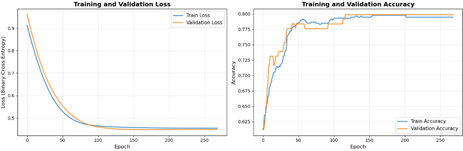
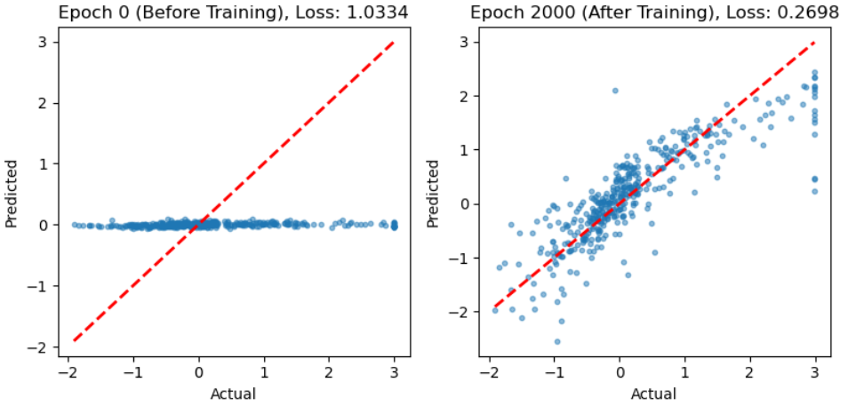

# DeepDiveAI

## About DeepDiveAI

DeepDiveAI is a hands-on code examples, notebooks, and implementations of various deep learning / ML techniques. 

Training and validation curves for logistic regression on Titanic data, showing rapid convergence and strong generalization.
Model achieves high accuracy (~80%) with well-matched loss and accuracy trends across epochs.

Scatter plots showing predicted vs actual house prices before and after training a linear regression model.
After 2000 epochs, predictions align closely with actual values, demonstrating effective learning and reduced loss.

**Note** : This repository is on progress. 
